**NOTE: This project was part of my contractual work for the business, conducted with the approval and consent of the business owner. Certain information has been removed to protect the business's privacy.**

# Pigment Squad – Store Hours Optimization (Jan–Jul 2025)

### About the Project
This project analyzes sales and operating patterns for Pigment Squad to answer a critical business question:  
**How can we optimize store hours and staffing to maximize profit while minimizing unnecessary cost?**

The analysis uses structured POS transaction data (SQL-based ETL pipelines, Bronze–Silver–Gold layers) with Power BI dashboards for visualization. Unlike the first project (product classification), this report focuses solely on **time-driven performance** to support operational decisions.

---

## Key Insights

### 1. Sales Performance
- $195k sales from 9,000 transactions (avg. $22 each).  
- Peaks in Jan, Apr (~$37k) and Jul (~$29k), driven by school holidays.  

  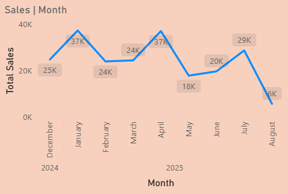
   
  <em>Fig. 1: Monthly Sales Trend</em>

                                                    
  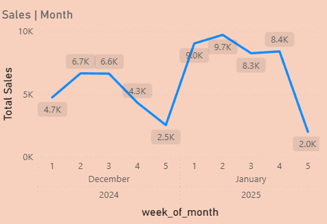
   
  <em>Fig. 1.5: Summer 2025</em>

  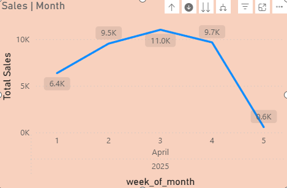
   
  <em>Fig. 1.5: Fall 2025</em>

  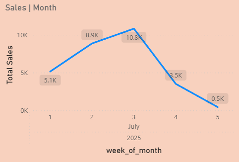
   
  <em>Fig. 1.5: Winter 2025</em>

---

### 2. Day & Hour Patterns
- Saturdays = >2× weekday average; Fridays strong.  
- Peak hour = **2pm (15% of all transactions)**.  
- 1–4pm block drives ~40% of sales.  

  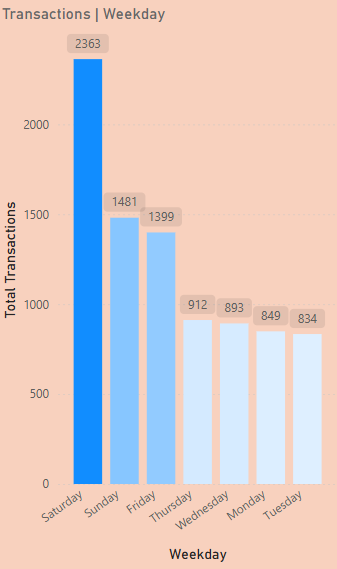
   
  <em>Fig. 2: Weekday Sales Patterns</em>

  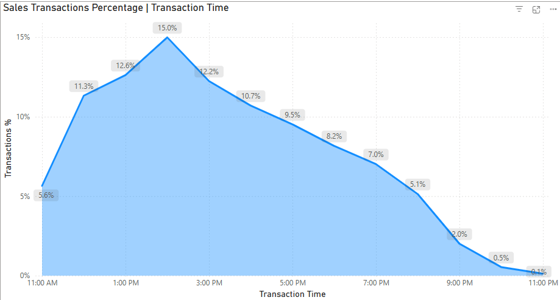
   
  <em>Fig. 3: Hourly Sales Patterns</em>

---

### 3. Product Mix
- Figurines = 70% of sales.  
- Varnish upsell low (~20% transactions) due to slow manual drying.  
- Investing in faster varnish process = opportunity to raise transaction value.  

  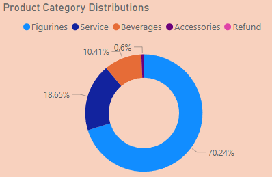
  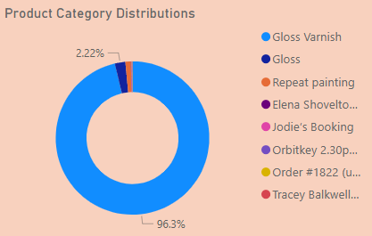
   
  <em>Fig. 3: Product Category Share</em>

---

### 4. Store Hours Efficiency
- Prime window: **12–5pm (esp. Fri–Sun)**.  
- Valuable “edge hours”: Fri–Sat before close, Sat–Sun after open.  
- Low yield: weekday mornings, Mon–Thurs late evenings.  

  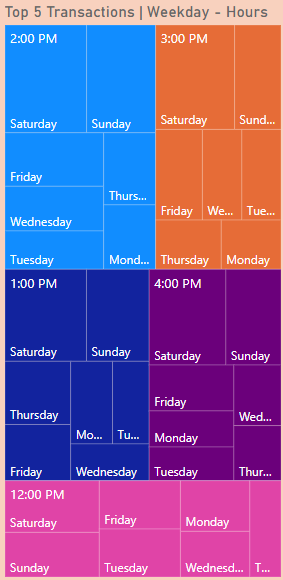
   
  <em>Fig. 4: Heatmap of Transactions by Weekday × Hour</em>

  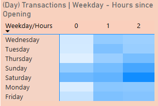
  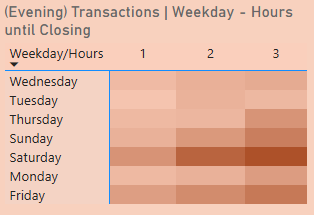
   
  <em>Fig. 5: Heatmap of Transactions by Weekday × Open/Close Hours</em>

---

## What-If Scenarios

- **Baseline:** 72 hrs/week, Staff cost $79.8k, Outside-hours sales $480.

 

  
   
  <em>Fig. 5: Store Operation Hour </em>

- **Scenario 1 (Shorter Hours):** Save $2.7k but lose ~$7.8k sales.  
- **Scenario 2 (Staff Cut, No Hour Change):** Save **$10.5k**, no sales loss ✅.  
- **Scenario 3 (Close Earlier Sun–Thurs):** Save $3.5k, lose ~$1.7k sales.  

  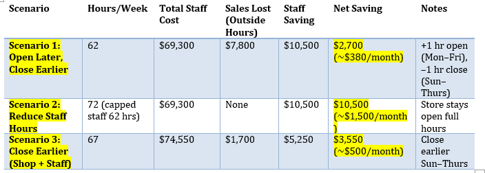
   
  <em>Fig. 6: Scenario Comparison – Cost vs Sales Impact</em>

---

## Recommendation
1. **Protect Revenue Hours**  
   - Keep core trading hours intact: **12–5pm, weekends, and Fri–Sat evenings.**  
   - Cutting these hours risks meaningful sales loss.  

2. **Trim Low-Value Hours**  
   - Early mornings and Mon–Thurs late evenings consistently underperform.  
   - These are the safest areas to reduce staff coverage or shorten operating hours.  

3. **Leverage Flexible Staffing**  
   - Cap weekly paid staff hours (~62 hrs/week) to unlock ~$10k annual savings.  
   - Use the business owner (or flexible staff shifts) to cover edge hours where sales are minimal but presence is still required.  

4. **Iterate and Monitor**  
   - Trial adjustments for 4–6 weeks.  
   - Use dashboards (heatmaps + scenario tracking) to confirm no significant sales loss.  
   - Adjust staffing mix if demand shifts.
---

### Deliverables
- SQL ETL scripts (Bronze → Silver → Gold)  
- Power BI dashboards (Sales Trends, Store Hours Matrix, Scenario Comparison)  
- Business summary (this README)
