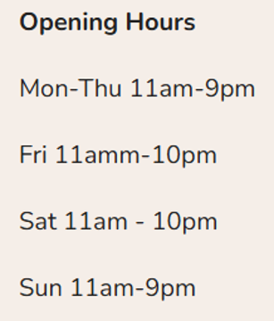

**NOTE: This project was part of my contractual work for the business, conducted with the approval and consent of the business owner. Certain information has been removed to protect the business's privacy.**

# Pigment Squad – Store Hours Optimisation (Jan–Jul 2025)

### About the Project
This project investigates Pigment Squad’s trading hours and staffing patterns to answer a key operational question:  
**How can the business reduce staff costs without risking meaningful sales loss?**

The work builds on structured POS transaction data processed through the SQL-based ETL pipeline (Bronze → Silver → Gold layers), with insights delivered through Power BI dashboards. 

---

## Key Insights

### 1. Sales Performance
From January to July 2025, the store generated **$195k from 9,000 transactions**, with an average spend of about **$22 per customer**.  
Sales peaked in **January and April (~$37k each)** and again in **July (~$29k)**, closely aligning with **school holidays and public events**.

  
   
  <em>Fig. 1: Monthly Sales Trend</em>

  <table>
    <tr>
      <td align="center">
         
        <em>Fig. 1.5: Summer 2025 (School break: 20/12/24-20/01/25)</em>
      </td>
      <td align="center">
         
        <em>Fig. 1.5: Fall 2025 (School break: 05/04/25-21/04/25)</em>
      </td>
      <td align="center">
         
        <em>Fig. 1.6: Winter 2025 (School break: 05/07/25-20/07/25)</em>
      </td>
    </tr>
  </table>

---

### 2. Day & Hour Patterns
- Saturdays = >2× weekday average; Fridays strong.  
- Peak hour = **2pm (15% of all transactions)**.  
- 1–4pm block drives ~40% of sales.  

  
   
  <em>Fig. 2: Weekday Sales Patterns</em>

  
   
  <em>Fig. 3: Hourly Sales Patterns</em>

---

### 3. Product Mix
- Figurines = 70% of sales.  
- Varnish upsell low (~20% transactions) due to slow manual drying.  
- Investing in faster varnish process = opportunity to raise transaction value.  

  
  
   
  <em>Fig. 3: Product Category Share</em>

---

### 4. Store Hours Efficiency
- Prime window: **12–5pm (esp. Fri–Sun)**.  
- Valuable “edge hours”: Fri–Sat before close, Sat–Sun after open.  
- Low yield: weekday mornings, Mon–Thurs late evenings.  

  
   
  <em>Fig. 4: Heatmap of Transactions by Weekday × Hour</em>

  
  
   
  <em>Fig. 5: Heatmap of Transactions by Weekday × Open/Close Hours</em>

---

## What-If Scenarios

- **Baseline:** 72 hrs/week, Staff cost $79.8k, Outside-hours sales $480.

 

  
   
  <em>Fig. 5: Store Operation Hour </em>

- **Scenario 1 (Shorter Hours):** Save $2.7k but lose ~$7.8k sales.  
- **Scenario 2 (Staff Cut, No Hour Change):** Save **$10.5k**, no sales loss ✅.  
- **Scenario 3 (Close Earlier Sun–Thurs):** Save $3.5k, lose ~$1.7k sales.  

  
   
  <em>Fig. 6: Scenario Comparison – Cost vs Sales Impact</em>

---

## Recommendation
1. **Protect Revenue Hours**  
   - Keep core trading hours intact: **12–5pm, weekends, and Fri–Sat evenings.**  
   - Cutting these hours risks meaningful sales loss.  

2. **Trim Low-Value Hours**  
   - Early mornings and Mon–Thurs late evenings consistently underperform.  
   - These are the safest areas to reduce staff coverage or shorten operating hours.  

3. **Leverage Flexible Staffing**  
   - Cap weekly paid staff hours (~62 hrs/week) to unlock ~$10k annual savings.  
   - Use the business owner (or flexible staff shifts) to cover edge hours where sales are minimal but presence is still required.  

4. **Iterate and Monitor**  
   - Trial adjustments for 4–6 weeks.  
   - Use dashboards (heatmaps + scenario tracking) to confirm no significant sales loss.  
   - Adjust staffing mix if demand shifts.
---

### Deliverables
- SQL ETL scripts (Bronze → Silver → Gold)  
- Power BI dashboards (Sales Trends, Store Hours Matrix, Scenario Comparison)  
- Business summary (this README)
